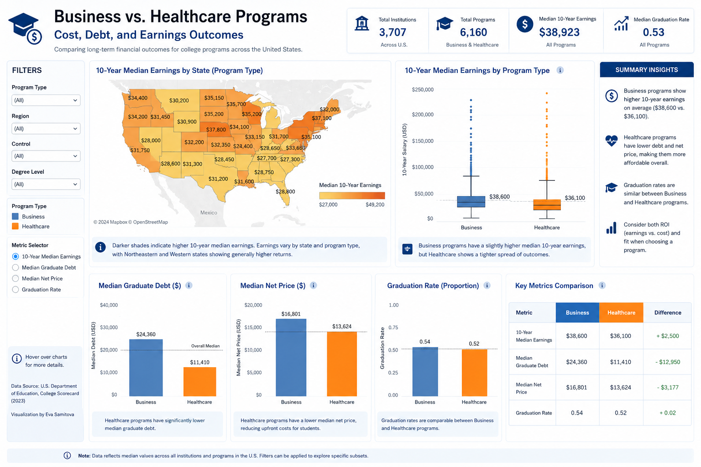
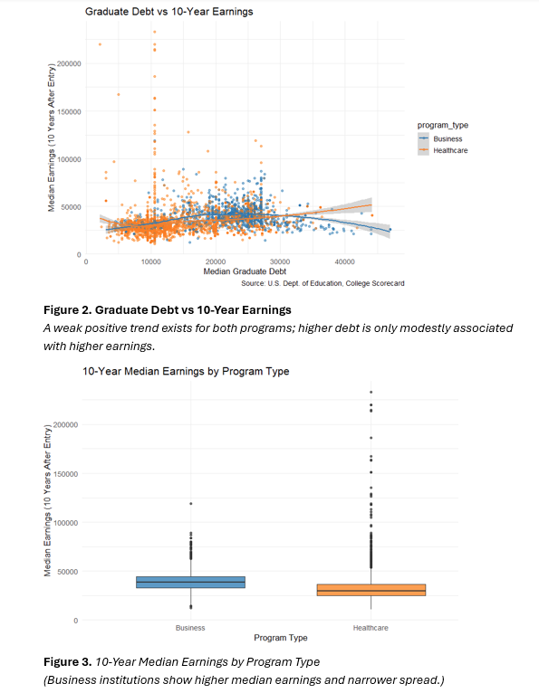
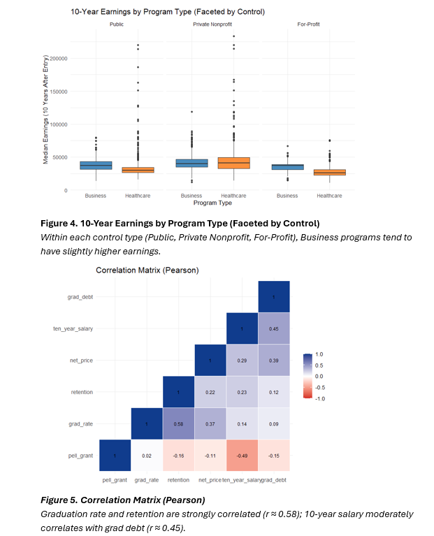
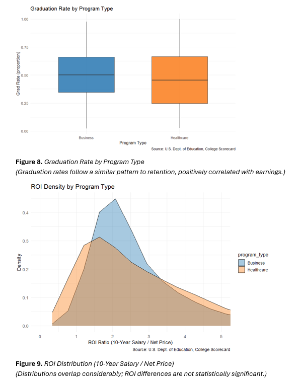

# 🎓 Degrees of Difference: What Impacts Earnings 10 Years After Graduation?

Comparative analytics project examining long-term earnings, debt, ROI, and institutional outcomes across U.S. Business and Healthcare programs.

---

## 📊 Project Overview

This capstone project analyzes which institutional and financial factors most strongly influence graduate earnings 10 years after college entry using the U.S. Department of Education College Scorecard dataset.

The analysis focuses on:
- Business vs Healthcare programs
- Graduate debt
- Net price and ROI
- Retention and graduation rates
- Geographic differences
- Early-career earnings
- Degree level comparisons

Using R, SQL, Tableau, and statistical modeling techniques, the project identifies the strongest predictors of long-term salary outcomes across U.S. colleges.

---

## 🛠 Tools & Technologies

- R / RStudio
- Tableau
- SQL
- Excel
- Python
- Power BI

Key libraries:
- tidyverse
- ggplot2
- randomForest
- dplyr
- MASS
- car
- lmtest

---

## 📈 Interactive Dashboard

https://public.tableau.com/app/profile/evdokia.samitov/viz/Capstone_BusinessVS_Healthcare/Businessvs_Healthcareprograms

---

## 🎥 Project Walkthrough

https://www.youtube.com/watch?v=WFrAXNiOIQs

---

## 🎨 Presentation Design

https://canva.link/gbqpw3bph2iiduy

---

## 📷 Key Visualizations

### Business vs Healthcare Outcomes Dashboard

### Graduate Debt vs 10-Year Earnings

### Correlation Matrix Analysis

### ROI & Graduation Analysis

---

## 🔍 Key Findings

- Early-career earnings were the strongest predictor of long-term salary.
- Graduate debt showed a moderate positive relationship with earnings.
- Higher Pell Grant percentages were associated with lower long-term earnings.
- Degree level had stronger predictive power than program type.
- Geographic effects became smaller after controlling for financial variables.
- Final Log-OLS model achieved an Adjusted R² of approximately 0.877.

---

## 📂 Repository Contents

- Final research report
- R analysis scripts
- Tableau dashboards
- Presentation slides
- Statistical modeling outputs
- Data preparation files
- Supporting documentation

---

## 📚 Dataset

U.S. Department of Education College Scorecard Dataset

---

## 👥 Project Team

- Eva Samitova
- Sofia Alentyeva
- Acshanah Pararajasingam
- Marenah Ryan

Bellevue College — BAS Data Management & Analytics
